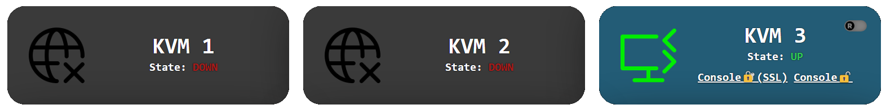

## KVM
### Pojekt prostej apki w oparciu o dane z bazy danych
*05.2023*
### Aplikacja pobiera informacje zapisane przez [KvmTracker](../app/) do bazy i wyświetla ich aktualny stan przy przeładowaniu strony. 

Dodatkowo posiada funkcjonalność zarezerwowania, zaimplementowaną przy użyciu [jQuery/AJAX](https://github.com/V0jcik/KvmTracker/blob/4209355009d93252fb76ac40130fd297039726ed/webDashboard/js/script.js#L25)
